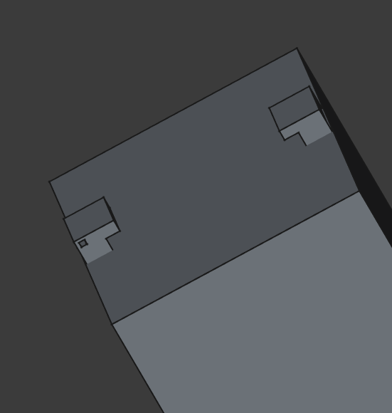

# Apprendre le modélisme 3D pour la création d’un KeyCube

## 1. Introduction

### 1.1 Objectifs du tutoriel

À travers ce guide, nous apprendrons :

- Les bases de **FreeCAD** et son interface  
- Les outils avancés pour modéliser des objets complexes  
- L’exportation des modèles pour l’impression 3D ou d’autres usages  

Que tu sois un passionné de fabrication numérique, un étudiant en conception, ou simplement curieux d’explorer le monde de la 3D, ce tutoriel te fournira les bases essentielles pour bien débuter avec FreeCAD.

### 1.2 Pourquoi choisir FreeCAD ?

- **Libre et Open-Source** : Gratuit, avec une communauté active.  
- **Modélisation paramétrique** : Modifications faciles grâce aux contraintes et paramètres.  
- **Polyvalent** : Adapté à la mécanique, l’architecture, l’impression 3D.  
- **Compatible avec plusieurs formats** : STL, STEP, OBJ, etc.

---

## 2. Installation et Configuration de FreeCAD

### 2.1 Installation de FreeCAD

Disponible sur Windows, macOS et Linux.  
Téléchargez-le sur : [https://www.freecad.org/downloads.php](https://www.freecad.org/downloads.php)

### 2.2 Configuration de FreeCAD

#### 2.2.1 Changer la langue

- Aller dans **Édition > Préférences**
- Onglet **Général**
- Choisir la langue

#### 2.2.2 Ajuster l'affichage et la navigation

- **Mode de navigation** : Édition > Préférences > Affichage > Navigation  
- **Déplacement** : Molette = déplacement 2D, Molette + clic droit = rotation 3D  
- **Unités** : Édition > Préférences > Unités (mm recommandés)  
- **Raccourcis clavier** : Édition > Préférences > Clavier

---

## 3. Création du modèle de support d’écran pour Keycube

### 3.1 Spreadsheet

Pour commencer, créez un nouveau fichier. Dans la barre des ateliers, sélectionnez **Spreadsheet**, puis créez une nouvelle feuille de calcul.

Cette feuille de calcul, qui ressemble à une fiche Excel, va nous permettre de stocker et centraliser nos variables tout en appliquant des contraintes entre elles. Voici un exemple de la fiche une fois le tutoriel terminé :

### 3.2 Création d’un objet simple

Il existe plusieurs façons de créer des objets dans FreeCAD. Nous allons utiliser l’atelier **Part**, car nous allons créer des objets simples dans ce tutoriel. Pour des formes et objets complexes, l’atelier **Sketcher** est plus adapté.

Allez dans l’atelier **Part**, puis cliquez sur Cube.

Dans la partie gauche de l’écran, vous verrez un cube créé dans l’arborescence. Cliquez dessus et un petit menu s’ouvrira en dessous de l’arborescence avec les informations de l’objet sélectionné.

Pour modifier les dimensions du cube, vous pouvez modifier les valeurs des variables dans la catégorie **Box**. Une fois les dimensions choisies, entrez les valeurs dans la feuille de calcul, puis attribuez un alias à chaque cellule avec un nom descriptif de la valeur.

Revenez sur la catégorie **Box** de l’objet, faites un clic droit sur **Length** -> **Expression**, et entrez la valeur : **Spreadsheet.le_nom_de_l’alias**
Faites de même pour les autres dimensions.
Si vous souhaitez modifier ultérieurement les valeurs, vous pourrez directement les ajuster dans la feuille de calcul.

Pour déplacer un objet dans l’espace, faites un clic droit sur l’objet dans l’arborescence, puis cliquez sur Transformer.

### 3.3 Opérations de 2 objets

#### 3.3.1 Fusion

- **Ctrl + clic gauche** pour sélectionner plusieurs objets
- Cliquer sur **Union**

#### 3.3.2 Soustraction

- Sélectionner l’objet principal en premier  
- Ctrl + clic gauche  
- Cliquer sur **Soustraction**

#### 3.3.3 Intersection

Pour récupérer la partie commune de deux objets, faites comme précédemment et appuyez sur **Intersection**.
Le fonctionnement est le même que pour la soustraction en **3.3.2** : tous les objets sélectionnés après le premier seront soustraits du premier.

#### 3.3.4 Opérations Booléennes

- D'autres opérations sont disponibles via **Opérations booléennes**

---

### 3.4 Création de la structure du support

Conservez le cube créé dans la section **3.2**. Il nous servira de base pour simuler la forme du **Keycube**, afin d’y modéliser notre support.

#### 3.4.1 Création des supports de fixation du système rotatif

Nous allons créer ici les supports qui maintiendront et bloqueront le système rotatif de l’écran.
 - Créez un **cube**, dupliquez-le et positionnez-le comme sur la photo.
 → À cette étape, les cubes n’ont pas encore la même forme que sur la photo, c’est normal.
 - Fusionnez **deux cercles superposés** et positionnez-les au milieu du **Keycube**, comme sur la photo.
 - Sélectionnez **Soustraction** pour enlever une partie du cube de maintien avec les disques rotatifs.
 - Répétez l’opération pour le second cube de maintien.

**Alternative** :  

  - Créer un cube  
  - Utiliser **Créer un objet miroir**  
  - Plan : **XY**
  - L'objet dupliqué est lié à l’original  
  - Le trou doit être dans le support dupliqué
  
**Note importante :** L’objet dupliqué est constamment lié à l’objet d’origine. Modifier l’original modifiera la copie, mais l’inverse n’est pas vrai.
Sur la photo en début de chapitre, un trou est présent dans le support. Il accueillera l’objet qui verrouille le système rotatif. Le support devra donc être celui dupliqué et non l’original.

#### 3.4.2 Création du disque rotatif

Dupliquez les disques créés précédemment, en gardant les mêmes dimensions, mais en réduisant légèrement leur taille afin qu’ils ne frottent pas pendant la rotation.

Créez ensuite un carré de la **dimension de l’écran choisi** et effectuez une **soustraction** pour créer un espace dans le disque.
 → L’objectif du trou est d’y placer l’écran sans qu’il dépasse, évitant ainsi de l’abîmer si le **Keycube** est posé sur la face de l’écran.

#### 3.4.3 Création du loquet

- Fusionner **quatre formes** :
  - Deux formes classiques  
  - Deux bras (fusion de rectangles + duplication)

#### 3.4.4 Création du trou dans le support pour le loquet

L’objectif est de créer suffisamment d’espace pour pouvoir insérer le loquet dans le support. Pour ce faire, il faut créer un grand espace dans le support et un loquet légèrement plus grand afin d’éviter les frottements.

Ici, le loquet plus grand et le carré servant à créer l’espace ont été fusionnés puis positionnés (le support est invisible, mais il est présent). Nous l’appellerons le “patron” de soustraction.

Effectuez une soustraction entre le support et le patron afin de créer un grand trou dans le support. Puis, répétez l’opération entre le patron et le disque rotatif.

Faites pivoter le patron de 90° et percez un trou de l’autre côté.

---

## 4. Résultat final

Et voici le résultat final ! Vous êtes maintenant prêt à **imprimer et exporter** votre modèle.

