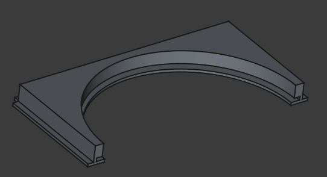
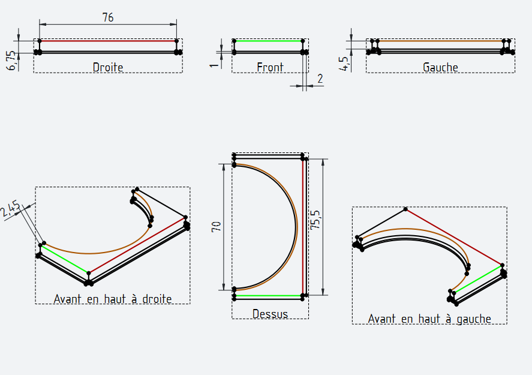

# Apprendre le modélisme 3D pour la création d’un KeyCube
- [Apprendre le modélisme 3D pour la création d’un KeyCube](#apprendre-le-modélisme-3d-pour-la-création-dun-keycube)
  - [1. Spreadsheet (Feuille de calcul)](#1-spreadsheet-feuille-de-calcul)
    - [Pour affecter une variable à un objet :](#pour-affecter-une-variable-à-un-objet-)
  - [2. Modélisation du KeyCube](#2-modélisation-du-keycube)
    - [2.1 Edges et Corners](#21-edges-et-corners)
    - [2.2 Support rotatif](#22-support-rotatif)
    - [2.3 La face de l’écran](#23-la-face-de-lécran)
      - [Création de la base :](#création-de-la-base-)
      - [Création du moule :](#création-du-moule-)
      - [Création des espaces aux coins :](#création-des-espaces-aux-coins-)
      - [Création du trou de la face du dessous :](#création-du-trou-de-la-face-du-dessous-)
  - [3. Résultat final](#3-résultat-final)
  - [4. Techdraw (Plans techniques)](#4-techdraw-plans-techniques)
    - [Création d’un plan TechDraw :](#création-dun-plan-techdraw-)
      - [Astuces de lisibilité :](#astuces-de-lisibilité-)

## 1. Spreadsheet (Feuille de calcul)

Pour commencer, créez un nouveau fichier. Dans la barre des ateliers, sélectionnez **Spreadsheet**, puis créez une nouvelle feuille de calcul.

Cette feuille de calcul, semblable à une fiche Excel, permet de centraliser les variables tout en appliquant des contraintes entre elles. Voici un aperçu de la feuille une fois le tutoriel terminé :

### Pour affecter une variable à un objet :
- Donnez un alias à la cellule contenant la valeur.
- Sélectionnez l’objet concerné.
- Dans l’onglet **Données**, faites un clic droit sur la caractéristique correspondante.
- Cliquez sur **Expression**, puis entrez le nom de la feuille suivi de l’alias.
- 

Toutes les mesures de toutes les pièces doivent être stockées dans des variables afin de faciliter les modifications ultérieures.

---

## 2. Modélisation du KeyCube

L’objectif de ce tutoriel est de créer la structure suivante :

### 2.1 Edges et Corners

Ces deux pièces ont été créées dans un tutoriel précédent. Vous pouvez retrouver leurs modèles 3D et une vidéo explicative aux liens suivants :

- [Modèles 3D GitHub](https://github.com/keycube/k3/tree/main/assets/freeCad/k3)
- [Chaîne YouTube](https://www.youtube.com/@keyblockuniv)

---

### 2.2 Support rotatif

L’objet est composé de trois parties : deux cylindres et un cube servant à percer les deux cylindres.

1. Ajoutez deux cylindres :
   - Un large et peu épais.
   - Un plus petit en diamètre mais plus haut.

2. Alignez-les l’un sur l’autre comme sur la photo, puis fusionnez-les.

3. Créez un cube plus haut que les cylindres afin qu’il les traverse entièrement. Positionnez-le au centre de la figure, de façon à ce qu’il dépasse en haut et en bas.

4. Utilisez l’outil **soustraction** : sélectionnez d’abord la fusion, puis le cube, pour créer le trou.

---

### 2.3 La face de l’écran

L’objet est composé de plusieurs parties :

- La **base** de la face, qui est la fusion de deux rectangles, construite avec la même logique que le support rotatif de l’écran (partie 2.2)
- Un trou dans la base de la face fait avec un moule afin de pouvoir y insérer le support de l’écran
- 2 petits carrés faisant des trous dans les coins de la base pour rentrer correctement dans les edges
- Un cylindre large afin de faire le trou dans la face du dessous de la base

#### Création de la base :
Dans le même principe que le support rotatif de l’écran, créez deux rectangles, l’un sur l’autre, dont vous allez couper la moitié.

Cette moitié sera dupliquée plus tard afin de constituer la base complète. Cela permet de lier les deux moitiés pour que toute modification sur l’originale soit répercutée.

#### Création du moule :
Répétez la création des deux cylindres du support rotatif, dont vous allez agrandir légèrement les dimensions.  
L’objectif est de créer un moule afin de faire un trou suffisamment large pour faire rentrer le support rotatif de l’écran, mais pas trop large pour éviter que la pièce bouge de manière involontaire.

- Faites la **soustraction** entre la base et les cylindres.

#### Création des espaces aux coins :
- Créez des petits cubes que vous allez disposer dans les coins, puis faites la soustraction.

#### Création du trou de la face du dessous :
- Créez un large cylindre et placez-le de sorte que la base se trouve au milieu de ce cylindre, puis faites la soustraction.

Votre pièce est maintenant prête, vous pouvez **dupliquer votre base** afin d’avoir une face complète en la positionnant en face.  
Mettez votre disque rotatif **au centre des deux bases** tout en vérifiant qu’elles rentrent correctement.

Cette image montre bien que le disque rotatif rentre correctement dans l’une des deux bases.

- Insérez les **modèles 3D des edges et corners** récupérés sur le GitHub et positionnez-les correctement autour de la face, tout en vérifiant que chaque pièce est insérée correctement dans les autres.
  

---

## 3. Résultat final

---

## 4. Techdraw (Plans techniques)

Une fiche TechDraw dans FreeCAD permet de générer des **plans techniques 2D à partir de modèles 3D**, incluant vues, cotes et annotations, pour la fabrication ou la documentation.  
Elle est utilisée pour produire des fichiers PDF ou DXF destinés aux ateliers ou à la communication technique.

### Création d’un plan TechDraw :
1. Dans le menu des ateliers, sélectionnez **TechDraw**.
2. Cliquez sur **Insérer une nouvelle page par défaut**.
3. Sélectionnez la page créée, puis l’objet à représenter.
4. Cliquez sur **Insérer une vue** et cochez les vues souhaitées. Ajustez les angles de vue selon vos besoins.
   
Pour ajouter des mesures, choisissez le bouton **“insérer une cote”** et cliquez sur l'arête, la surface ou deux points afin d’obtenir leurs mesures.
#### Astuces de lisibilité :

- Afin de mieux se repérer, vous pouvez **mettre certaines arêtes en couleur** et les répertorier dans toutes les vues comme ci-dessus ; cela aide à bien visualiser la pièce et à ne pas se perdre.  
Pour choisir une couleur, double-cliquez sur une arête et choisissez ce qui vous convient parmi les différents styles et couleurs.

